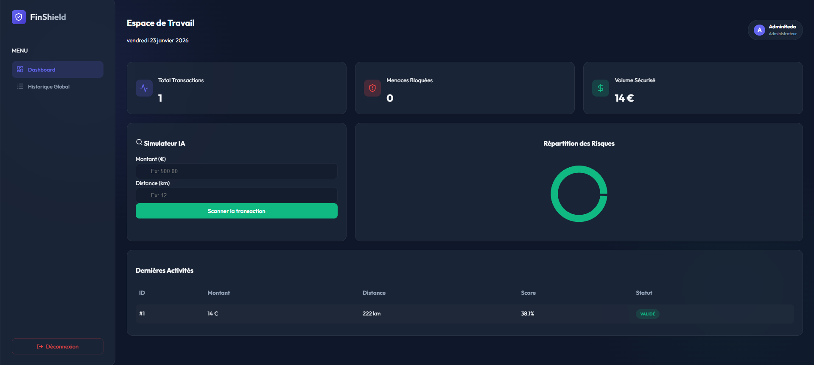

# 🛡️ FinShield AI - Intelligent Fraud Detection System


**FinShield AI** is a secured, full-stack microservices application designed to detect credit card fraud in real-time. It combines a **Secured Spring Boot** backend, a modern **Glassmorphism React** dashboard, and a **Python AI** engine.

---

## ✨ Key Features

* **🔐 Secure Authentication:** Full Login/Register system using **Spring Security** and **JWT (JSON Web Tokens)**.
* **👮 Role-Based Access Control (RBAC):**
    * **ADMIN:** Full access to global statistics, charts, and transaction history.
    * **USER:** Restricted access (Simulation mode only).
* **🧠 AI-Powered Detection:** Real-time fraud probability analysis using a **Random Forest** model (Python/Scikit-Learn).
* **🎨 Modern UI:** Sleek **Glassmorphism** design with **React Toastify** notifications and responsive charts.
* **🐳 Fully Dockerized:** One command to run the entire stack (Database + API + Frontend + AI).

---

## 🚀 Architecture

The project follows a decoupled **Microservices Architecture**:

1.  **Frontend (React + Vite):** A secured dashboard that manages JWT tokens and adapts the UI based on user roles.
2.  **Core Banking Service (Spring Boot):**
    * Handles User Registration & Login.
    * Issues & Validates JWT Tokens.
    * Manages Business Logic & H2 Database.
3.  **Fraud Detection Service (Python FastAPI):** A dedicated AI microservice serving the Machine Learning model.

---

## 📸 Screenshots

| Login View |

|  |

---

| Dashboard View |

|  |

---

## 🛠️ Tech Stack

* **Frontend:** React, Vite, Recharts, Lucide-React, React-Toastify, CSS Modules (Glassmorphism).
* **Backend:** Java 21, Spring Boot 3, **Spring Security 6**, **JJWT**, Spring Data JPA.
* **AI/ML:** Python 3.9, FastAPI, Scikit-Learn, Pandas.
* **DevOps:** Docker, Docker Compose, Nginx.

---

## 📦 Installation & Setup

### Prerequisites
* [Docker Desktop](https://www.docker.com/products/docker-desktop/) installed and running.

### 1. Clone the Repository
```bash
git clone [https://github.com/YOUR_USERNAME/FinShield-AI.git](https://github.com/whosredais/FinShield-AI.git)
cd FinShield-AI
```
### 2. Run with Docker (The Magic Command) 🐳

Build and start all services (Frontend, Java, Python) with a single command:

```bash
docker-compose up --build
```
Wait until you see the logs:

"Started CoreBankingApplication" (Java API)

"Uvicorn running" (Python API)

## 🖥️ Access the Application

Once Docker is running, access the services via your browser:

Frontend Dashboard	   http://localhost:5173         START HERE - The main user interface
Java API	             http://localhost:8081	       Core Banking API (Swagger/Endpoints)
Python API	           http://localhost:8000	       Fraud Detection Engine (FastAPI Docs)

---
## 🧠 The AI Model (Dataset)

The model included (real_fraud_model.pkl) is pre-trained using the Random Forest algorithm on the Kaggle Credit Card Fraud Detection Dataset.

Want to re-train the model?
Due to GitHub file size limits, the raw CSV dataset is not included in this repo.

Download creditcard.csv from Kaggle

Place it in the fraud-detection-service/ folder

Run the training script (requires Python installed locally):
```bash
cd fraud-detection-service
pip install pandas scikit-learn joblib
python train_kaggle.py
```
---

## 🧪 How to Test (Demo Accounts)
The application automatically assigns roles based on the username used during registration.

1️⃣ Access the App
Go to: http://localhost:5173

2️⃣ Scenario A: The Administrator (Full Access)
Register with a username starting with admin (e.g., adminReda).

Password: Any password.

Result: You will see the Charts, KPIs, and the Global Transaction History.

3️⃣ Scenario B: The Employee (Restricted Access)
Register with any other username (e.g., RedaUser).

Password: Any password.

Result: You will only see the Simulation Form. The history tab will be locked 🔒.

---
## 👨‍💻 Author

Full Stack Developer & AI Enthusiast

LinkedIn Profile : https://www.linkedin.com/in/mohamed-reda-boujir-a62087294/

---
